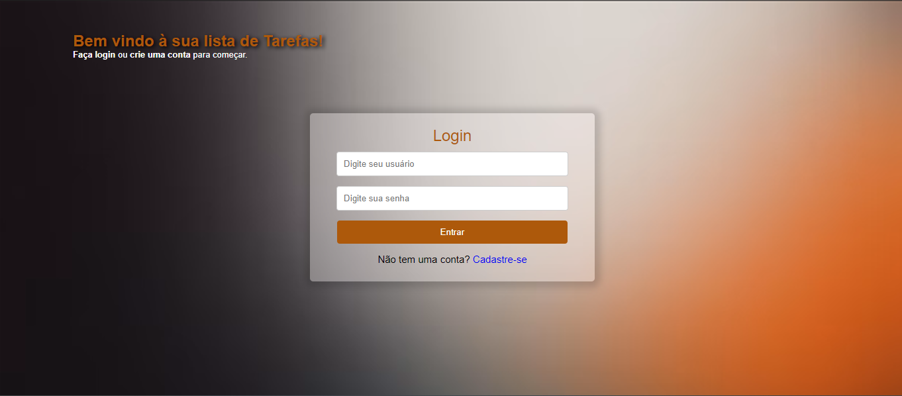
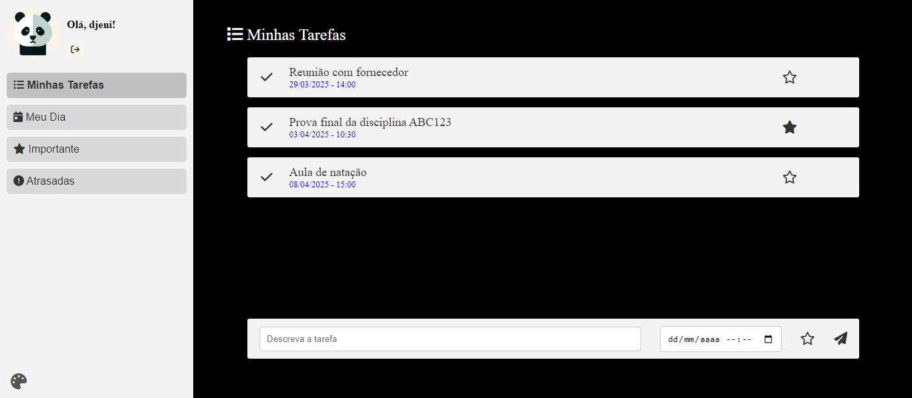

# ToDoList v2.0

Este projeto é a versão 2.0 do projeto ToDo_List. O objetivo do desenvolvimento da versão 2.0 foi adicionar funcionalidades não existentes na primeira versão, além de ser meu objeto de estudo de aplicação da tecnologia Angular.

A aplicação consiste em um sistema de gerenciamento de tarefas, onde os usuários cadastrados poderão registrar e organizar suas atividades diárias, como lembretes para consultas médicas ou provas na faculdade.

## Tecnologias Utilizadas
  - Front-end:  TypeScript (Angular), HTML, CSS
  - Back-end: PHP
  - Banco de Dados: MySQL

## Funcionalidades
  - Cadastro de Usuários: Criação de usuários com login controlado por usuário e senha.
  - Cadastro de Tarefas: Inclusão de tarefas com descrição, data prevista e marcação de prioridade.
  - Alteração de Prioridade: Possibilidade de alterar a prioridade das tarefas a qualquer momento.
  - Marcação de Conclusão: Marcar tarefas como concluídas.
  - Listagem de Tarefas:
    - Minha Lista: Exibe todas as tarefas pendentes com data futura.
    - Meu Dia: Exibe todas as tarefas pendentes com a data do dia atual.
    - Importante: Exibe todas as tarefas pendentes com data futura e prioridade alta.
    - Atrasadas: Exibe todas as tarefas pendentes com data anterior ao dia atual.
  - Escolha de Tema: Ação para escolher entre 3 opções de temas (Ligth, Dark e Color)

    
## Layout final do projeto

### Tela de login

### Tela home

Desenvolvido por: Djenifer Starosky.
